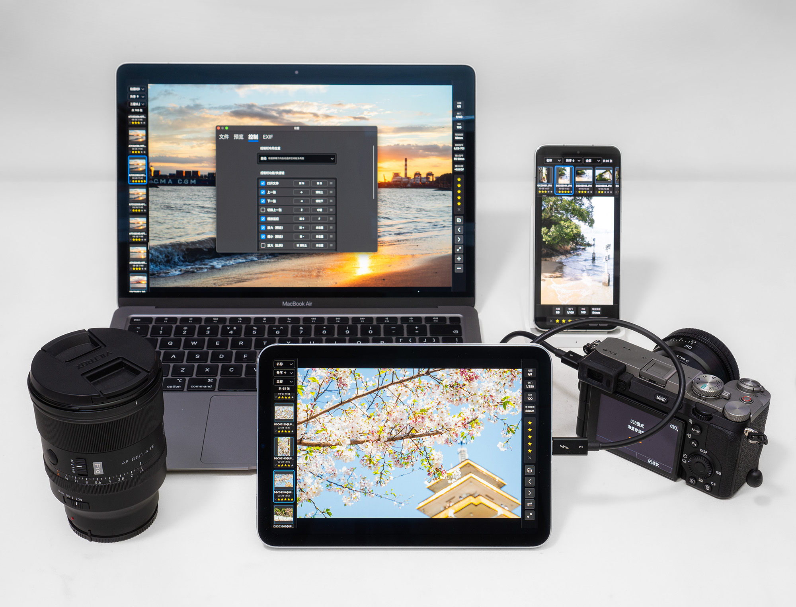
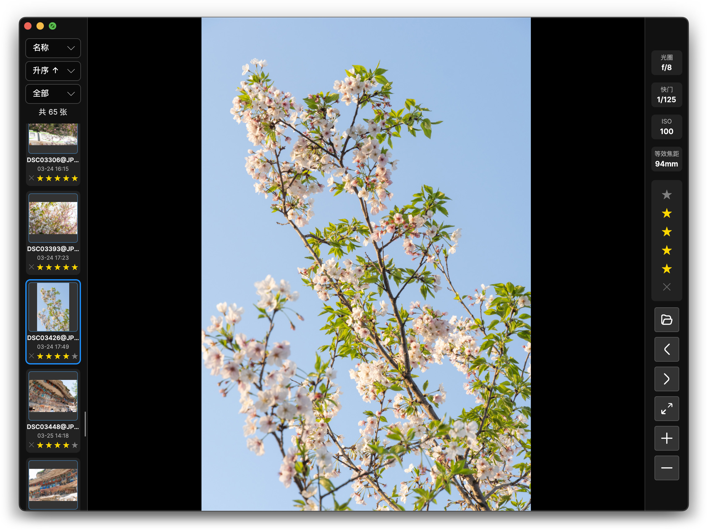
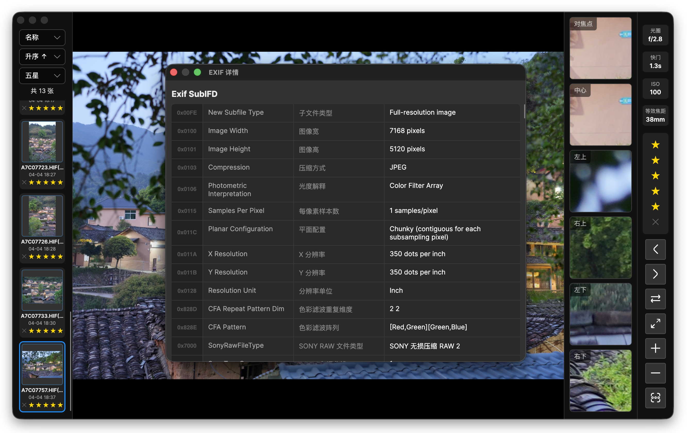
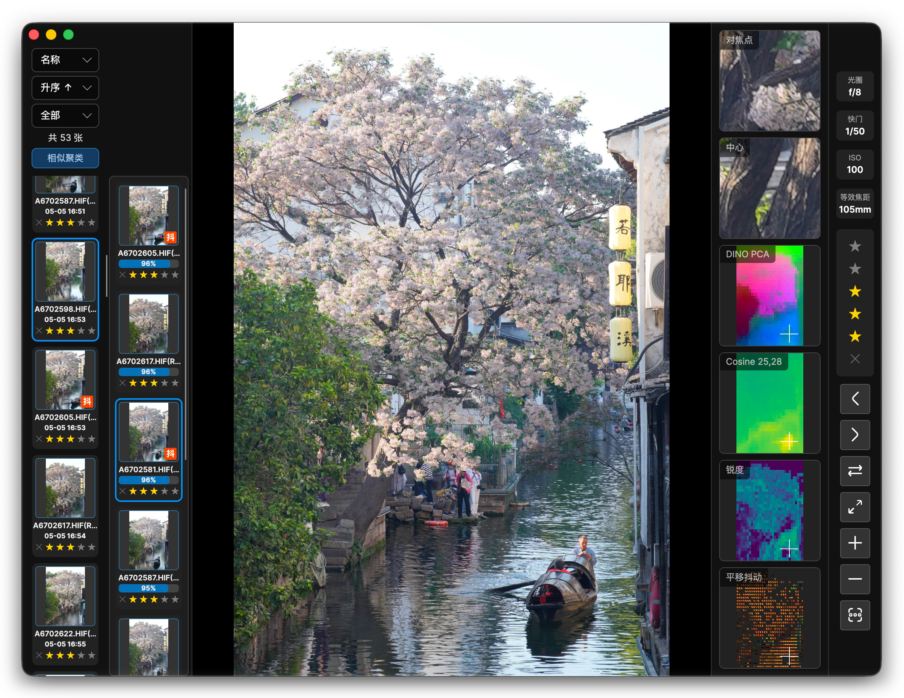

# PhotoViewer

一个基于 Avalonia 开发的全平台照片查看器，专为摄影选片流程优化设计。

## 项目简介

PhotoViewer 是一款专为摄影师打造的高效选片工具，支持 Windows、macOS、iOS 和 Android 平台。专注于优化摄影工作流，让选片过程更加快速、随时随地，帮助您在拍摄后第一时间筛选出最佳作品。

目前主要适配 SONY 相机，支持全平台 HEIF 10bit 422 解码、ARW 评分星级写入，支持较为完善的 EXIF 解析（例如 SONY 对焦点）。

## 核心特色

### 底层基建
- **全平台支持**：随时随地 USB 连接相机开始使用，所有核心功能（例如 HEIF 解码）全平台适配最佳方案。
- **快速加载**：良好的文件缓存和预载管理，切换照片、写入星级不卡顿

### UI 优化
- **质量优先**：始终解码最高质量照片，0 缩略图代替。
- **信息精简**：照片占据主要空间，仅在剩余区域显示精简的 EXIF、星级、操作按钮

### 交互优化
- **高效筛选**：支持自定义触屏按钮、快捷键，在任何平台快速浏览、对比、标星
- **多格式同步**：针对 RAW+JPG/HEIF 拍摄习惯，自动当作同张照片同步管理星级

### 工具
- **EXIF 解析**：扩充解析各种元数据，包括 SONY 私有加密字段解析

## AI 赋能

### 相似聚类
- **语义级别的相似度计算**：内嵌 DINO v3 模型，提取照片特征向量、区块语义，归类同视角、同场景或同主体、同类别等各种差异程度的照片，快速查看同类雷同照片。

### CV 筛查
- **锐度检测**：检测各区块边界清晰程度，显示锐度热力图。
- **抖动检测**：检测各区块的各向异性方向和强度，综合判定平移、旋转手抖情况。

## 推荐工作流程

1. **拍摄阶段**：相机设置为 RAW + JPG / HEIF 格式拍摄
2. **预选阶段**：利用零散时间（如交通工具上）通过 USB 直连相机进行初筛
3. **精选阶段**：在空闲时间（如酒店内）拷卡至笔记本进行精选
4. **归档阶段**：可以使用其他工具（如 SONY Imaging Edge Desktop）筛选并移动照片的文件夹，本应用暂不开发
5. **后期阶段**：精选后的照片导入 PS 后期处理

## 平台支持

### 已测试平台
- **Windows 11**
- **macOS** （MacBook Air M1）
- **iPadOS** （iPad mini A17 Pro）
- **Android** （小米 13 / 17 Ultra）

### 已测试相机
- **SONY A7C2**
- **SONY A6700**
- **SONY A6100**
- *其他品牌相机的 RAW 标星功能暂未测试，为避免文件损坏，使用前应先验证可靠性*

### 平台支持情况

| 功能 | Windows | macOS | iOS/iPadOS | Android |
|-----|---------|-------|------------|---------|
| JPG 预览 | ✅ 支持 | ✅ 支持 | ✅ 支持 | ✅ 支持 |
| HEIF 预览 | ✅ LibHeif | ✅ 原生 | ✅ 原生 | ✅ LibHeif |
| SONY ARW 标星 | ✅ 支持 | ✅ 支持 | ✅ 支持 | ✅ 支持 |
| 其他 RAW 标星 | 未测试 | 未测试 | 未测试 | 未测试 |
| EXIF 解析 | ✅ 支持 | ✅ 支持 | ✅ 支持 | ✅ 支持 |
| 快捷键 | ✅ 支持 | ✅ 支持 | ✅ 外接键盘 | ✅ 外接键盘 |
| 触摸 | 触控板待优化 | 触控板待优化 | ✅ 触屏手势 | ✅ 触屏手势 |
| 下载 | [Releases](https://github.com/XiaoJHcc/PhotoViewer/releases) | [Releases](https://github.com/XiaoJHcc/PhotoViewer/releases) | 暂未上架 | [Releases](https://github.com/XiaoJHcc/PhotoViewer/releases) |

## 安装与使用

### 下载安装
[Releases 页面](https://github.com/XiaoJHcc/PhotoViewer/releases) 

- **Windows** : 下载 `PhotoViewer.Windows.exe` 直接运行
- **Android** : 下载 `PhotoViewer.Android.apk` 并安装
- **macOS** : 下载 `PhotoViewer.Mac.dmg`，打开映像，将 `PhotoViewer.Mac.app` 拖入右侧 `Applications` 文件夹。首次启动若提示"Apple 无法验证…移到废纸篓"，有以下两种方法解除：
  - **方法一**：双击 DMG 中的 `安装 PhotoViewer.command`，按提示完成后即可正常打开
  - **方法二**：打开 `系统设置 → 隐私与安全性`，滚动到底部，点击 `仍要打开`

> *iOS 版暂未上架 AppStore，如需使用可使用 Mac 电脑自行编译安装*

## 开发

### 开发环境配置
参见文档 DEV.md

### 待开发功能
- **完善相似度检查的产品能力（连拍/HDR/堆栈自动分组）**
- **基于 ViT 的美学评级算法**（主要 AI 研究方向）

## 许可证

本项目使用 [LibHeif](https://github.com/strukturag/libheif) 开源库解码 HEIF 格式照片，使用 [ExifTool](https://github.com/exiftool/exiftool) 的源码参数用于补充解析 EXIF 信息，遵循协议采用 [GPL 许可证](LICENSE)。