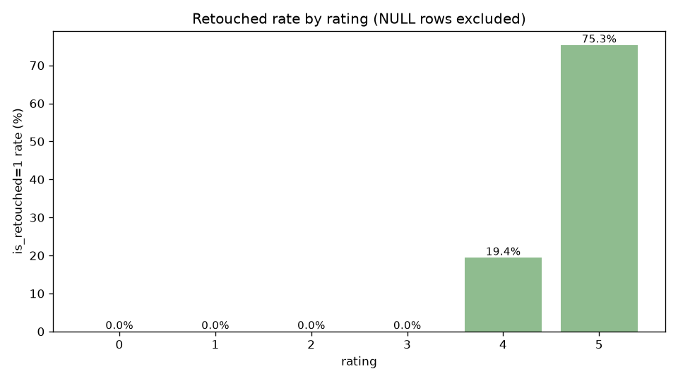
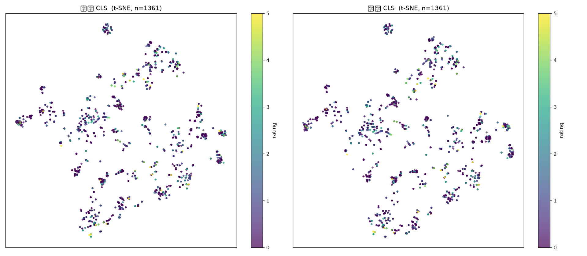
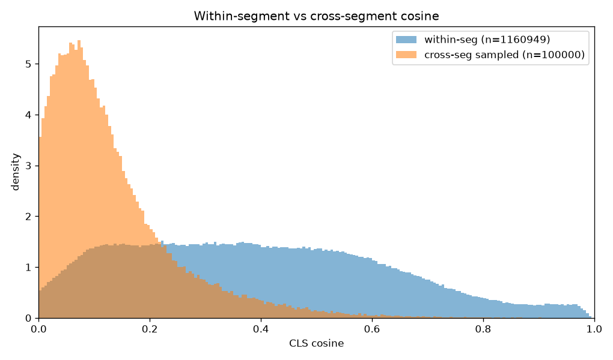
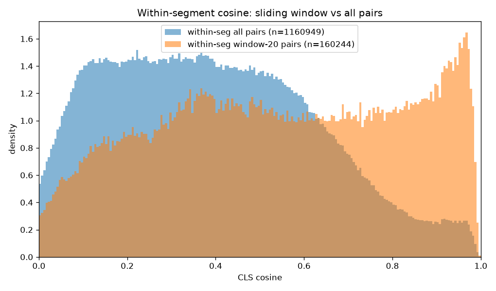
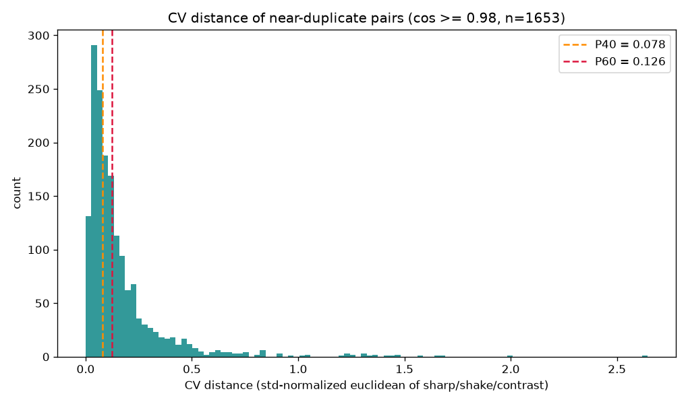
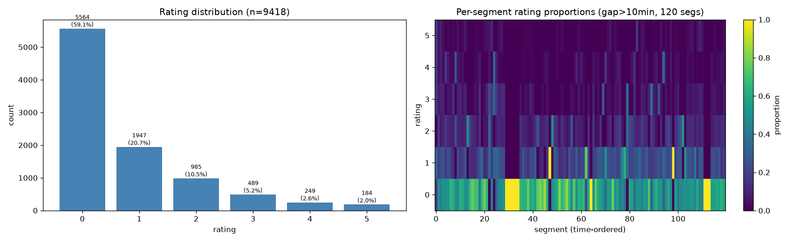
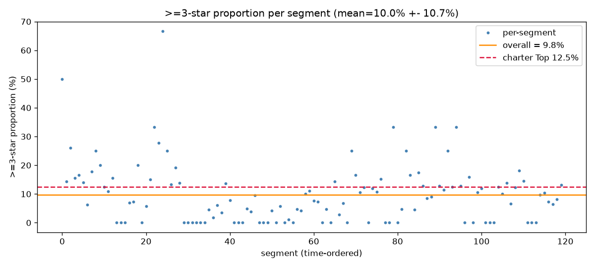

# 分析历程 — 我们如何走到现在的结论

> **人读版叙事**：图文并茂记录三期（DINOv3 照片美学评分）M1 数据地基 + 特征可行性的分析路径——哪些证据改变了决策、现在的结论是什么形状。**持续更新**：后续里程碑的分析故事继续追加；过时章节可覆写，优先保留"改变过决策"的证据。
>
> 机器真源：[../STATUS.md](../STATUS.md)（当前进度）/ [../EXECUTION-LOG.md](../EXECUTION-LOG.md)（逐次实验台账）/ [../plans/](../plans/)（宪法与分册计划）；本文是它们的叙事化索引。最后更新：2026-07-19。

---

## 0. 一句话现状

**跨段零迁移是标签结构问题、不是特征瓶颈**（ViT-S/ViT-L 同灭）→ **M2 锚定（评分偏移 + 精修锚点 + 特征泛化）是引入跨段绝对尺度的唯一主路**；backbone 定格 ViT-S；§1.5 绝对标尺重标（200 张）进行中。

---

## 1. 起点：要替代什么，手里有什么

- **要替代的**：一次外拍 ~600 张、约 **5 小时**人工筛片；目标压到 **Top 12.5%（≥3★）** 进人工细看，≥3★ 召回 ≥80%。
- **手里的数据**：9418 指纹组（同次曝光 RAW/HIF/JPG 合一）、11 个事件、gap=10min 切 120 拍摄段；每张照片四路特征（ViT-S 原片 CLS + 增强 CLS + patch token + CV 物理质量网格）+ EXIF + 人工星级 0-5。
- **标签的本质（一切分析的出发点）**：星级是**段内锦标赛逐轮 Top ~50% 晋级的"生存结果"**——0-3★ 偏局部（临近相似中选优），3-5★ 偏全局（事件内总体美学最优）。它给出的**段内相对信号很强，跨段绝对信号几乎为零**（好天气的 3★ 和坏天气的 3★ 实际水准差很多，但标签一样）。这个性质决定了后面所有的失败与出路。

## 2. 数据地基：先确认标签能信

- **层级交叉验证**：F: 盘文件夹层级（无后缀=0★ / -OK=1-2★ / ARW3=3★+）与 XMP 星级比对，**5170 组零不一致**——星级可读性 GATE 通过。
- **0★ 语义终裁（用户）**：两个盘**全部已评，0★ 就是真 0★**（XMP 0/缺失不再当"未评"）。回填 2732 行后全库 9418 组无 NULL：0★5564 / 1★1947 / 2★985 / 3★489 / 4★249 / 5★184。
- **精修回溯（M2 锚点的关键腿）**：8 个 OUT-JPG 目录 152 件导出件，按"文件名（剥 `@JPG` 后缀）+ 事件"匹配，**150 个精修原片落标**，零未命中。跨事件同名（相机计数 rollover）14 个按事件域证据链处置、零误伤。

> **精修只落在高星**：5★ 有 75.3% 被精修、4★ 19.4%、0-3★ 为零。这不是缺陷，是语义——"我愿意花时间精修它"是**只存在于顶端的强偏好信号**，所以它只能当 M2 的**顶端锚点**（少量、高精度、按张高权），不能当全量监督。

## 3. 特征可行性探针：一部三连否定的故事

核心问题：**backbone 的特征差异，能不能线性分出"同段内哪张星级更高"？**（决策 7：架构定型前先线性探针，≥80% 即基座够用。）

### 3.1 第一探（2026-07-18，单批 20240212）：全 chance，但分不清两种死法

单日雾天纯风光批，段级留出（整段做测试）下三制式全在 40-45%——**全 chance**。但这批内容极同质，无法分辨是 **H1（ViT-S 特征弱）** 还是 **H3（单批同质 worst case）**。结论：别盲升 ViT-L，先建多样批。

### 3.2 重探（2026-07-19，10 事件多样批）：H3 排除，H1 坐实

> **这张 t-SNE 是整个 H1 结论的肉眼版**：1361 张照片的 CLS 特征压到二维，颜色=星级。聚簇全按**内容**（同场景挤成一团），而颜色在各簇内**随机混杂**——特征记住的是"拍的是什么"，不是"哪张更好"。（图题方框是 matplotlib 无中文字体的乱码。）

量化版更狠：多样批段级 split 全 24 组合 **47–51%**，且三组诊断把"侥幸解释"逐一封死——

- **按星级边界拆**（0-1 技术边界 vs 3-4 美学边界）：全 45-50%，无边界差异 → 不是"技术差异能分、美学不能分"；
- **按事件拆**：各事件 41.6-53.0%，无题材差异；
- **事件条件化**（每事件独立方向，Kronecker 4224 维）：仍 chance → 不是"单一全局规则表达不了题材化标准"。

**H1 坐实**：ViT-S/16@518 的 CLS 差异特征不携带可跨段迁移的细粒度排序信号。

### 3.3 标注学引入：唯一的正面信号

用户确认两段标注机制后，探针拆双模式：**局部段（0-3★，滑窗配对域）** 与 **全局段（≥3★，事件全集配对域）**。结果全局段**事件内对级对照 79.3/79.1/84.0%**——高星美学排序在**事件语境内**有强可学性（vs 局部段仅 60-62%）；但**事件级留出仍全 chance**。形状：绝对美学信号在事件内存在，却不跨事件迁移。

### 3.4 H2 空间坍缩也排除

"是不是池化把信息丢了？"——保留 32×32 空间结构的探针头（空间金字塔/微型 CNN）同样 49.4-50.7%，train acc 都勉强。**瓶颈是特征本身，不是池化。**

## 4. 决策 8 梯 2（ViT-L 重提复测）：2×2 判读定案

按宪法升级梯，ViT-L/16 重提 9418 组双路 CLS（parity 1.000000），同一套探针双模型同口径复测：

| | 跨段/跨事件 split（迁移能力） | 事件内对级（可学性上界） |
|---|---|---|
| **局部段** | ViT-S 49.9 → ViT-L 53.0 | ViT-S 61.3 → ViT-L 65.9 |
| **全局段** | ViT-S 50.0 → ViT-L 51.0 | ViT-S 79.3 → **ViT-L 90.2** |

**判读**：跨段迁移 ViT-L 只换 +1~3pt、仍贴 chance（离 ≥80% 线极远）→ **换 backbone 解决不了跨段问题，它是标签结构问题**；事件内 +10pt 是真实差距但只是含泄漏上界。于是：

- **主路定案**：跨段绝对尺度只能从**非标签来源**引入——评分偏移（3a)/可学习段偏置（3d)、精修锚点（3b)、特征泛化（3c)——即 M2 锚定路线，与 backbone 无关。
- **backbone 定格 ViT-S**（用户裁定）：四路全量在库、端侧 86MB 可落地；ViT-L 升级路不死锁（双路 CLS 已共存，重提机制 ~1h/轮；梯 3 分辨率、梯 4 LoRA 在册）。

## 5. data_audit：看清真实分布，把阈值全部校准

> **本审计最关键的一张图**：段内配对（蓝）的相似度分布一路拖到 1.0，跨段配对（橙）在 0.725（P99.9）彻底归零——**cosine>0.88 的对几乎必然同场景**（段内 2.66% vs 跨段 0.007%，380 倍分离）。宪法"内容相似度当可比性主信号"有了定量地基，τ_lo=0.73（混入 <0.1%）由此定。

> 橙色（滑窗 20 张内配对）在 0.9-1.0 高相似区鼓起——滑窗确实捞出了"临近相似"的比较域（你选片时的真实工作域）。window=20 对 cos≥0.95 高相似对覆盖 88.3%，window=40 仅 +5.6pt 但对数 +88% → **window=20 定格**。

> 1653 对"几乎一样"（cos≥0.98）照片的物理质量差异分布：左端贴零的一坨是"真 tie"（人工只能随机择一的极相似对）——判 tie 丢弃的阈值 τ_cv=0.078~0.126 由此分布定。

> 左：全库 0-5★ 金字塔。右：120 段每段星级占比热力图——各行颜色跨段大体均匀，**"每段星级分布大致相同"（锦标赛段内归一化）在大段层面成立**（≥30 张段 KL 均值 0.057），小段波动是采样噪声。

> 每段 ≥3★ 占比散点：均值 9.8%，围绕理想值 12.5%（虚线）大幅浮动——**用户裁定**：12.5% 是理想锦标赛（50%³），逐级过选率实际在 35-60% 浮动，实测 9.8% 只是本批实况、**不改产品目标口径**。左侧那簇高占比段即"好天气事件"的真实画像。

**校准值（冻结）**：window=20；τ_hi=0.98 / τ_lo≈0.73；τ_cv 0.078~0.126；相似度→权重锚点 cos 0.973→1.0 / 0.918→0.8 / 0.786→0.5 / 0.540→0.3 / <0.73→0；M2 人工偏移工作量 120~240 张评级 = 半天~一天（决策 3a 可行）。

## 6. 结论的形状与下一步

三句话收束 M1：

1. **可靠的能力是段内相对排序**（事件内可学性 79-84%，ViT-L 90-94%）——保底交付（段内 ranking + 每段 Top 配额 + 去重 + 废片闸门）在构造上就成立；
2. **跨段绝对分是"特征泛化 + 锚点"的尽力外推**——裸特征零迁移已双模型证死，只能靠 M2 锚定引入；
3. **特征不是瓶颈、标签结构才是**——后续投入全部押在锚定与配对工程，不再折腾 backbone。

**进行中**：§1.5 绝对标尺重标——200 张 ≥3★ 抹星级副本（11 事件 × 73 段），用户按锦标赛从 3 往上重标，读回后测 CLS 差异向量对**新绝对标尺**的可分性，直接定 M2 里人工偏移（3a) 与学习偏置（3d) 的配比。然后 M1 关门、进 M2。

---

## 附：本文图表清单

| 图 | 来源 | 它支撑的决定 |
|---|---|---|
| `figures/tsne_orig_vs_enh.png` | feature_probe（20240212 单批） | H1：特征按内容聚簇、不按星级 |
| `figures/retouched_by_rating.png` | data_audit §5 | 精修=顶端锚点，非全量监督 |
| `figures/cos_within_vs_cross.png` | data_audit §3 | 相似度闸门合法；τ_lo=0.73 |
| `figures/cos_window_vs_segall.png` | data_audit §2 | window=20 定格 |
| `figures/cv_dist_neardup.png` | data_audit §6 | tie 阈值 τ_cv |
| `figures/rating_dist.png` | data_audit §1 | 锦标赛段内归一化成立 |
| `figures/top3_per_segment.png` | data_audit §8 | 12.5% 理想值 vs 批次实况 9.8% |
